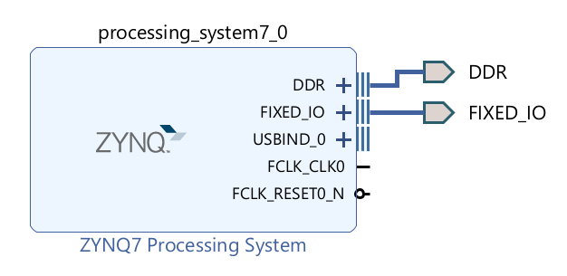
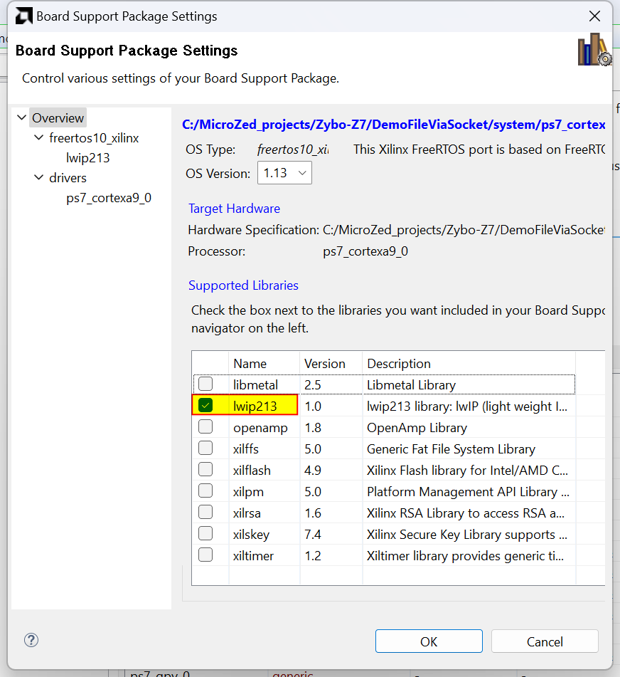
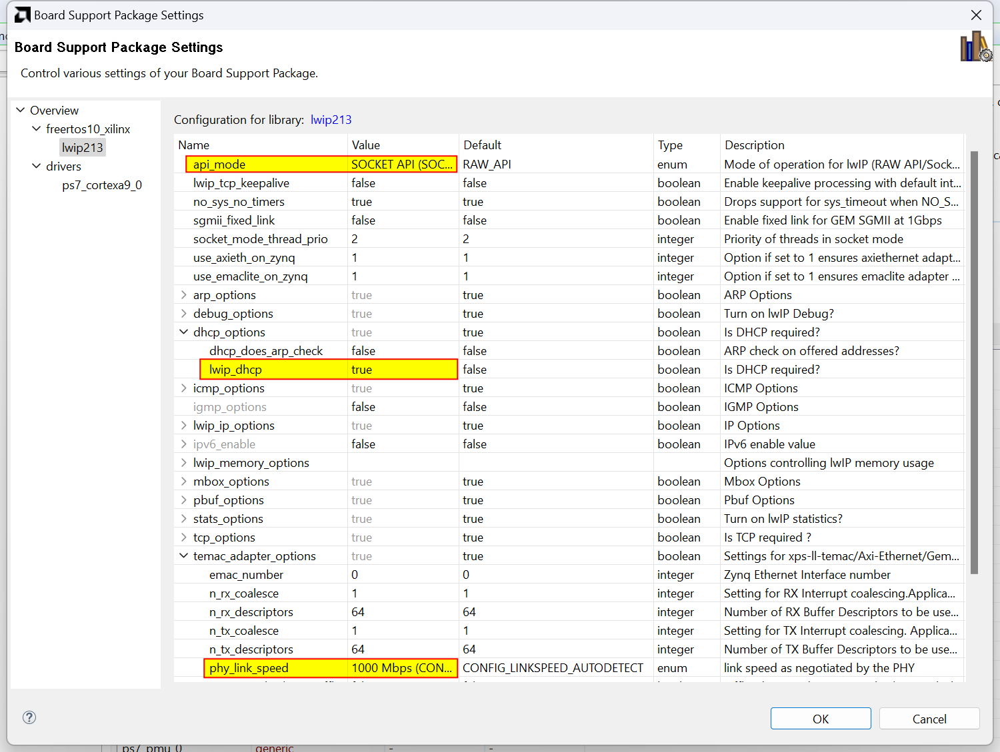

[](https://opensource.org/licenses/BSD-2-Clause)

# "File via socket" for lwIP
This repository provides a C++ ostream class (client) and a Python script (server) for writing a file on a remote system via an IP socket connection.  
My primary motivation for creating this was the abiliity to upload extensive debug data (e.g., data from an ADC) from a standalone application running in [FreeRTOS](https://xilinx-wiki.atlassian.net/wiki/spaces/A/pages/18842141/FreeRTOS) on AMD [Xilinx Zynq](https://www.xilinx.com/products/silicon-devices/soc/zynq-7000.html) SoC (FreeRTOS uses the [lwIP](https://savannah.nongnu.org/projects/lwip/) stack).  
Nevertheless, the C++ class works also on Windows and Linux.

For example, when you start the server like this

```
python3 file_via_socket.py --path ~/test_data --bind_port 63333
```

and use the following code in the application

```c++
{
    FileViaSocket f( "192.168.44.44", 63333 ); // Connect to the server
    f << "Data:\n";                            // Write the header row
    std::array<int, 3> SampleData = {1, 2, 3};
    for(auto element : SampleData)
        f << element << '\n';                  // Write a data row
} // Destructor on 'f' is called, the connection is closed
```

then the file `~/test_data/via_socket_240318_213421.5840.txt` (he file name contains the time stamp for the connection) is created on the server with the content

```
Data:
1
2
3
```

## How to use

### Client-side

The files [FileViaSocket.h](FileViaSocket.h) and [FileViaSocket.cpp](FileViaSocket.cpp) define the class [FileViaSocket](FileViaSocket.h#L80).

I tested the class FileViaSocket (and made sure it's ready for compilation) on FreeRTOS on AMD Xilinx Zynq SoC (Vitis 2023.1 toolchain), Windows 11 (MinGW toolchain in [CLion](https://www.jetbrains.com/clion/)), and Ubuntu 22.04 (gcc toolchain).

FileViaSocket acts as a regular C++ ostream class but doesn't write any data locally. Everything is sent to the server via a socket connection, and the server (a Python script) writes all incoming data verbatim to a file.

You can open the connection using the parameterized constructor  
 `FileViaSocket( const std::string &serverIP, unsigned short port )`  
or by the method  
`void open( const std::string &serverIP, unsigned short port )`.   
Both may raise an exception if an error occurs.

Connection is closed by the destructor of the class FileViaSocket or by calling the method `void close()`. After calling `close`, you can call the `open` again.

You use FileViaSocket as any other ostream. Typically, you will use `operator<<` or the method  
`std::ostream::write(const char* s, streamsize n)`.

Please note that **the FileViaSocket has an internal data buffer** of the size of the amount of data that can be sent in a single TCP packet.  
I tested using [Wireshark](https://www.wireshark.org/) that on FreeRTOS on Xilinx Zynq (using lwIP 2.1.3) 1446 bytes of data are sent in one TCP packet. On Ubuntu 22.04 it's 1448 bytes, and on Windows 11 it's 1460 bytes of data.  
There are three versions of the constant [SocketBuffer::SOCKET_BUFF_SIZE](FileViaSocket.h#L45) for each of the three platforms.

> [!IMPORTANT]
>
> I discourage you from using ostream manipulator `std::endl` to mark the end of a line of text. This is because `std::endl` has a side effect of flushing the data buffer, i.e., sending a TCP IP packet. It is not efficient to send a TCP IP packet for each line. It's better to fill the data buffer with 1446 bytes of data first.

On the other hand, if you want to flush the buffer on purpose in order to see data on the server, so it appears in the file on the server, the manipulators `std::endl` and `std::flush` will work for you.

#### Demo code

The following code demonstrates various aspects of using the class FileViaSocket (it's a simplified version of the code of [the demo app](demo_app_FreeRTOS_on_Zynq/DemoFileViaSocket.cpp) for FreeRTOS on Xilinx Zynq).

```c++
const std::string    SERVER_ADDR( "192.168.44.44" ); //Specify proper server address here
const unsigned short SERVER_PORT{ 65432 }; //The server script file_via_socket.py uses
                                           //port 65432 by default.

void demo_FileViaSocket_thread(void *p)
{
    try {
        FileViaSocket f( SERVER_ADDR, SERVER_PORT ); // Declare the object and open the connection
        f << "Hello world!\n"; /* We are using '\n' on purpose instead of std::endl, because
                                * std::endl has a side effect of flushing the buffer, i.e.,
                                * "Hello world!\n" would be immediatelly sent in a TCP packet. */
        f << "I'm here.\n";
        f << std::flush;       /* We are explicitly flushing the buffer, "Hello world!\nI'm here.\n"
                                * is sent in a TCP packet. */
        f << "It worked.\n";
    } // Object f ceases to exist, destructor on 'f' is called, buffer is flushed,
      // "It worked.\n" is sent in a TCP packet, the socket connection is closed,
      // a file is created on the server
    catch( const std::exception& e ) {
        // Handle the exception
    }

    /* We must give the server some time to close the connection on its end.
       Otherwise, the next call of 'open' would fail because of refused connection. */
    vTaskDelay( pdMS_TO_TICKS( 50 ) ); // Wait 50 ms

    FileViaSocket f; // We just declare the object, no connection is made

    try {
        f.open( SERVER_ADDR, SERVER_PORT ); // Open connection to the server
    } catch( const std::exception& e ) {
        // Handle the exception
    }

    f << '1' << "23456" << 78; // We can write all kinds of data types to an ostream
    f.close(); // Close the connection, another file is created on the server

    vTaskDelay( pdMS_TO_TICKS( 50 ) ); // Wait 50 ms

    try {
        f.open( SERVER_ADDR, SERVER_PORT ); // Open a new connection on the same object
    } catch( const std::exception& e ) {
        // Handle the exception
    }

    // Prepare a buffer to be written to the server
    const unsigned BUFF_SIZE{ 26*1000 }; // Beware of the size of thread's stack!
    char buffer[BUFF_SIZE];
    for( unsigned i = 0; i < BUFF_SIZE; i++ )
        buffer[i] = 'A' + i % 26; // Fill with repeated sequence from 'A' to 'Z'
    
    f.write( buffer, BUFF_SIZE ); // Write the whole buffer to the server
    f.close(); // The connection is closed, third file is created on the server

    vTaskDelete(NULL); // All done, we end this thread
}
```

### Server-side

The Python script [file_via_socket.py](file_via_socket.py) works as a server for the FileViaSocket class.

It writes all data sent by the class FileViaSocket verbatim to a file. Each session (open, write, close) is written to a new file.  
The standard name of the file the server creates looks like this: via_socket_*240324_203824.6369*.txt  
Part of the name in italics is the date and time stamp.

Depending on your Python installation, run the script with the command `python3 file_via_socket.py [params]` or `python file_via_socket.py [params]`.

I tested the script on Ubuntu 22.04 and Windows 11.

The default port the script listens on for connections is 65432, and the default bind IP address is 0.0.0.0 (i.e., the script listens on all the configured network interfaces).

#### Usage:

```
usage: file_via_socket [-h] [--path PATH] [--prefix PREFIX] [--ext EXT] [--bind_ip BIND_IP]
                       [--bind_port BIND_PORT]

options:
  -h, --help             show help message and exit
  --path PATH            path for storing the files; defaults to current working directory
  --prefix PREFIX        prefix of the file name; defaults to "via_socket"
  --ext EXT              extension for the file name; defaults to "txt"
  --bind_ip BIND_IP      local IP to bind the socket listener to; defaults to 0.0.0.0
  --bind_port BIND_PORT  local port to listen to connection on; values: 1024..65535; defaults to 65432
```

## Demo application

### Demo on Linux and Windows

The file [demo_app_Linux_or_Win/DemoFileViaSocket.cpp](demo_app_Linux_or_Win/DemoFileViaSocket.cpp) contains a demo application showcasing the use of the class FileViaSocket.  
On Linux, you can easily compile it with the command:

```
g++ -o DemoFileViaSocket DemoFileViaSocket.cpp FileViaSocket.cpp
```

The executable takes the server's IP address as the command line parameter. It connects to the server's default port 65432; it can be changed by modifying the value of the constant `SERVER_PORT`.

The app creates three test files on the server. The app's output looks as follows: 

```
$ ./DemoFileViaSocket 192.168.44.44
"Hello world" sent
"12345678" sent
Buffer sent. All done.
```

### Demo on FreeRTOS on AMD Xilinx Zynq

The file [demo_app_FreeRTOS_on_Zynq/DemoFileViaSocket.cpp](demo_app_FreeRTOS_on_Zynq/DemoFileViaSocket.cpp) contains a demo application for FreeRTOS on Xilinx Zynq Soc.  
The folder [project_files](demo_app_FreeRTOS_on_Zynq/project_files) contains the HW design made in Vivado 2023.1 and a SW app workspace for Vitis 2023.1.   
The HW design was made for the [Digilent Zybo Z7-20](https://digilent.com/shop/zybo-z7-zynq-7000-arm-fpga-soc-development-board/) board; nevertheless, any other Zynq board with Ethernet can be used.

#### HW design

The HW design is the simplest possible Zynq design. We need just the Zynq Processing System.



#### SW app and Vitis setup

The sample [Vitis workspace](demo_app_FreeRTOS_on_Zynq/project_files/DemoFileViaSocket_sw) provides an environment for building the demo app source file  [DemoFileViaSocket.cpp](demo_app_FreeRTOS_on_Zynq/DemoFileViaSocket.cpp) for FreeRTOS.

Let me provide a few notes on Board Support Package (BSP) settings needed for successfull compilation of the demo app with lwIP.

First, you need to enable the lwIP in the BSP:



The following settings are then needed in the lwIP BSP configuration:

- Set api_mode to "SOCKET API" because this api_mode is required for a stand-alone application.
- Set dhcp_options/lwip_dhcp to true because the app code is using DHCP to obtain an IP address.

- (optional) On my network, the Zybo Z7 wasn't able to negotiate link speed. Therefore, I manually set temac_adapter_options/phy_link_speed to "1000 Mbps" to resolve the issue. This may be just a problem related to my particular network router. You may try to leave phy_link_speed on the default autodetect setting.


